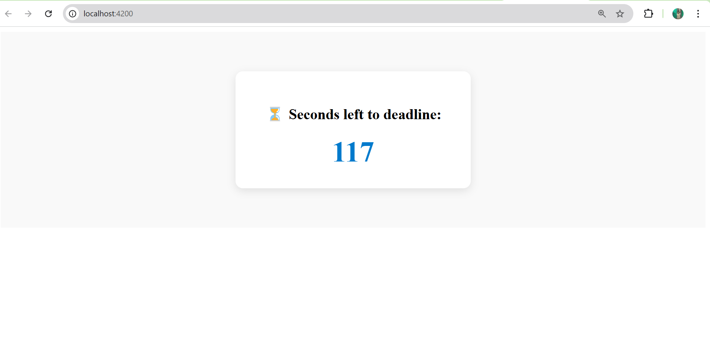

# ⏳ Task 1 – Countdown Timer (Angular)

A self-contained, performance-optimized Angular 16 standalone component that displays a countdown timer based on an API response.

---

## 📚 Contents

- [Stack](#-stack)
- [Problem Statement](#-problem-statement)
- [Live Demo](#-live-demo)
- [Screenshots](#-screenshots)
- [How to Run Locally](#-how-to-run-locally)
- [How It Works](#-how-it-works)
- [Unit Tests](#-unit-tests)
- [Architecture Decisions](#-architecture-decisions)
- [Future Enhancements](#-future-enhancements)
- [Author](#-author)

---

## 📦 Stack

- Angular 16
- Standalone Component
- RxJS (`interval`, `switchMap`, `takeWhile`)
- Dependency Injection (`inject()`)
- Unit Testing with Jasmine & TestBed

---

## 🧠 Problem Statement

> An endpoint `/api/deadline` returns `{ secondsLeft: number }`.  
> Build a component that fetches this once and displays a countdown timer (`X seconds left to deadline:`), updating every second until zero.

---

## 🚀 Live Demo

📍 [Live App Link (https://sandeshth148.github.io/frontend-coding-phase-2/)](https://sandeshth148.github.io/frontend-coding-phase-2/)  
📷 Screenshots below ↓

---

## 🧪 Screenshots

| Desktop View  
| -------------------------------------
| 

---

## 🛠️ How to Run Locally

```bash
git clone https://github.com/Sandeshth148/frontend-coding-phase-2.git
cd task1-angular
npm install
ng serve -o
```

## 🧰 How It Works

### ✅ `DeadlineService`

Mock service returning an Observable of `{ secondsLeft: number }` with slight delay.

```ts
return of({ secondsLeft: 120 }).pipe(delay(300));
```

### ✅ CountdownTimerComponent

Standalone Angular component

Injects service

Starts interval(1000) and counts down from the API value

```ts
secondsLeft$ = this.deadlineService.getDeadline().pipe(
  switchMap((response) =>
    interval(1000).pipe(
      startWith(0),
      map((i) => response.secondsLeft - i),
      takeWhile((seconds) => seconds >= 0)
    )
  )
);
```

### ✅ Unit Tests

Countdown logic fully tested

Mocked service response

Tests use fakeAsync, tick, discardPeriodicTasks

```bash
ng test
```

### ✨ Architecture Decisions

| Area                | Decision                                       |
| ------------------- | ---------------------------------------------- |
| Angular Version     | Angular 16 (latest stable)                     |
| Component Type      | Standalone                                     |
| API Mocking         | `DeadlineService` returns `Observable`         |
| Reusability         | Easy to copy-paste into any Angular app        |
| RxJS vs setInterval | RxJS `interval()` for reactivity & testability |
| Styling             | Pure SCSS, no frameworks used                  |

<!-- 🌱 Future Enhancements (on separate branch)
Angular Elements version (createCustomElement) for use in non-Angular apps

Support for multiple countdowns from a JSON array

Localization & accessibility improvements

Signal-based version (Angular 17+) -->

## 👋 Author

### Sandesh
